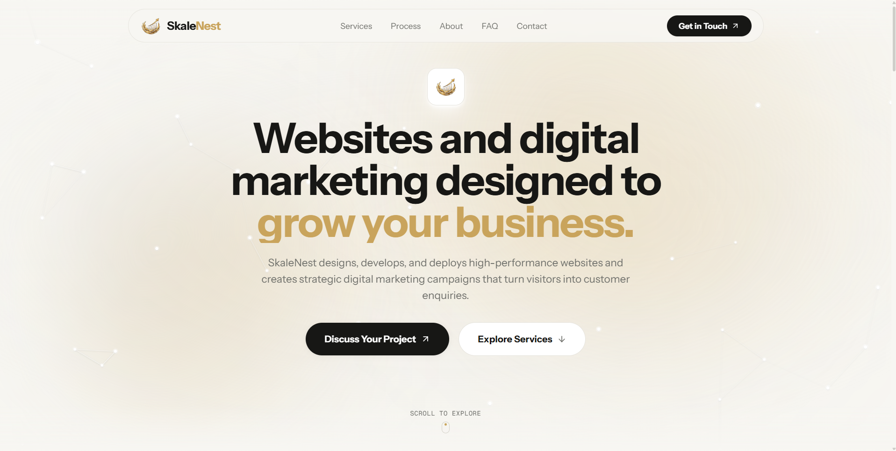
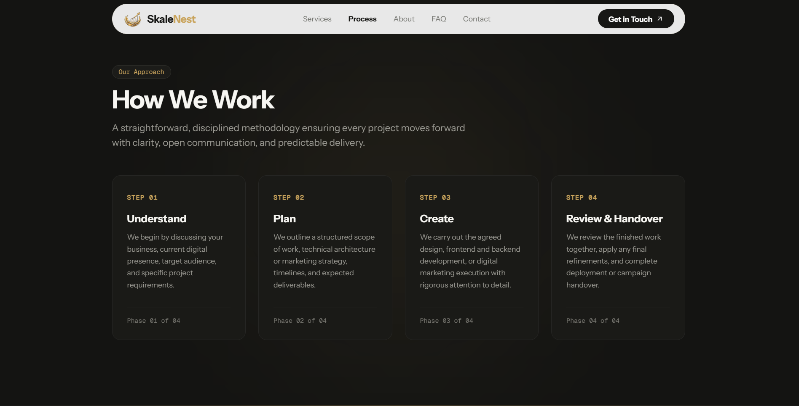

<p align="center">
  <a href="https://github.com/mizan989/SkaleNest">
    
  </a>
</p>

<div align="center">

# SkaleNest

### Modern website design, engineering, and digital marketing for growing businesses. High-performance digital presence engineered with craft, clarity, and dependable execution.

<br/>

<a href="#-quick-start"></a>
<a href="https://skalenest.vercel.app"></a>
<a href="https://github.com/mizan989/SkaleNest/discussions"></a>

<a href="#-ways-to-run-skalenest"></a>
<a href="https://skalenest.vercel.app"></a>

<a href="https://github.com/mizan989/SkaleNest/stargazers"></a>
<a href="LICENSE"></a>
<a href="https://nextjs.org"></a>
<a href="https://react.dev"></a>
<a href="https://www.typescriptlang.org"></a>
<a href="https://tailwindcss.com"></a>
<a href="https://lenis.darkroom.engineering"></a>

</div>

> [!TIP]
> **Live Production Website Ready!** Explore the responsive, smooth-scrolling experience live at **[skalenest.vercel.app](https://skalenest.vercel.app)** — [Get started locally in under 60 seconds](#-quick-start).

---

## SkaleNest Overview

SkaleNest is a modern digital agency platform purpose-built for growing businesses that require high visual craft, flawless frontend engineering, and results-oriented digital marketing. Moving away from cookie-cutter templates, bloated retainers, and opaque promises, SkaleNest delivers disciplined digital solutions combining bespoke UI/UX design, modern full-stack web development, and targeted multi-channel marketing campaigns.

Engineered on **Next.js 14 App Router**, SkaleNest integrates fluid **Lenis inertial smooth scrolling**, tailored micro-interactions, an ultra-slim theme-matched scrollbar, and 100% self-hosted variable typography for instantaneous rendering with zero third-party font tracking.

**Key Capabilities:**

- **Editorial Quiet Luxury Aesthetics** — Warm Off-White (`#F7F6F2`) paired with Earthy Charcoal (`#141412`), champagne gold accents (`#C9A45C`), and balanced typographic rhythm
- **Fluid Inertial Smooth Scrolling** — Powered by `@studio-freight/lenis` with custom deceleration curves, touch-device pass-through, and zero-jitter anchor targeting
- **Full-Lifecycle Digital Services** — Unified workflow encompassing brand strategy, wireframing, frontend engineering, backend integrations, and campaign deployment
- **Zero Third-Party Font Tracking** — 100% self-hosted Instrument Sans and Geist Mono typefaces eliminating external Google Fonts DNS handshakes and layout shifts
- **Dual-Theme Section Contrast** — Light open workspaces for Hero, Services, About, and Contact contrasted against rich dark containers for Process and FAQ
- **Interactive Multi-Channel Conversion** — Validated project enquiry form with Formspree integration alongside direct verified email and WhatsApp routing
- **Ultra-Slim Theme Scrollbar** — 80% reduced thickness (3px) with subtle champagne gold accent thumb and transparent track
- **Production Performance & SEO** — Fully static pre-rendered routes, OpenGraph metadata, structured JSON sitemap, and automated `robots.txt`

<br>

<div align="center">
  <pre>
┌─────────────────────────────────────────────────────────────────────────────────┐
│                                   SKALENEST                                     │
│            Design ➔ Develop ➔ Deploy ➔ Market ➔ Measure ➔ Scale                 │
├───────────────────────────────┬─────────────────────────────────────────────────┤
│  🎨 Editorial UI/UX & Web Dev │  ⚡ High-Performance Tech Stack                 │
│   • Quiet luxury aesthetics   │    • Next.js 14 App Router (React 18)           │
│   • Fluid Lenis smooth-scroll │    • TypeScript 5 + Tailwind CSS                │
│   • 100% self-hosted fonts    │    • Zero-layout-shift responsive layouts       │
├───────────────────────────────┼─────────────────────────────────────────────────┤
│  📈 Digital Marketing & Growth│  📬 Direct Lead Conversion Engine               │
│   • Positioning & targeting   │    • Integrated Formspree endpoint              │
│   • Multi-channel campaigns   │    • Direct WhatsApp & Email channels           │
└───────────────────────────────┴─────────────────────────────────────────────────┘
  </pre>
</div>

---

## UI Preview

<p align="center">
  
</p>

<p align="center">
  
</p>

---

## Core Capabilities & Services

SkaleNest delivers end-to-end solutions designed to scale with your business:

- **High-Impact Landing Pages & Marketing Sites** — Conversion-focused, single-page and multi-page marketing websites designed to convert visitors into active enquiries.
- **Custom Frontend & Web Applications** — Clean semantic HTML5, modern React/TypeScript components, accessible navigation, and micro-animations.
- **Backend & Database Integrations** — Robust CMS setup, authentication workflows, REST/GraphQL APIs, serverless handlers, and database connections.
- **Strategic Digital Marketing** — Audience segmentation, competitive positioning, multi-channel growth campaigns, and content strategies aligned with concrete business targets.
- **Performance & Technical SEO** — Sub-second First Contentful Paint (FCP), 0 Cumulative Layout Shift (CLS), automated sitemaps, and optimized search engine discovery.

---

## 🚀 Quick Start

**Prerequisites:**
- Node.js 18.x or higher
- npm, pnpm, or yarn

### Installation & First Run

```bash
# 1. Clone the repository
git clone https://github.com/mizan989/SkaleNest.git
cd SkaleNest

# 2. Install dependencies
npm install

# 3. Start development server
npm run dev
```

Open **[http://localhost:3000](http://localhost:3000)** in your browser to view the application.

> [!NOTE]
> The contact form connects to Formspree (`https://formspree.io/f/xnpavapk`) by default. To point submissions to your own endpoint, update `FORMSPREE_ENDPOINT` in `src/components/Contact.tsx`.

---

## Ways to Run SkaleNest

- **Live Cloud Production** — Hosted live on Vercel with automatic edge SSL and CDN distribution. [Visit Website](https://skalenest.vercel.app)
- **Local Full-Stack Development** — Fast local development with hot-module replacement via Next.js. [Quick Start](#-quick-start)
- **Production Self-Hosted Bundle** — Compile the static export or Node server bundle (`npm run build`) and serve via Vercel, Node.js, Nginx, or Docker.

---

## ☁️ Workspaces & Sections

SkaleNest delivers an editorial narrative structured across dedicated sections:

- **Floating Glass Navbar** — Fixed dynamic header featuring section auto-detection, smooth anchor routing, and mobile drawer navigation.
- **Hero & Value Proposition (`#top`)** — Centered emblem lockup, high-impact headline, direct CTAs, and interactive constellation background.
- **Capabilities & Services (`#services`)** — Service breakdown showcasing website design, full-stack engineering, and digital growth marketing.
- **How We Work (`#process`)** — Dark charcoal (`#141412`) four-stage methodology: *01 Understand ➔ 02 Plan ➔ 03 Create ➔ 04 Review & Handover*.
- **Brand Philosophy (`#about`)** — Split editorial layout covering core principles: *Clarity Over Complexity*, *Quality-Driven Engineering*, and *Transparent Collaboration*.
- **Common Questions (`#faq`)** — Darkened accordion interface resolving the 5 most critical questions regarding deliverables, process, and onboarding.
- **Start an Enquiry (`#contact`)** — Client-validated submission form with real-time feedback, error states, and direct WhatsApp / email contact links.
- **Footer (`footer`)** — Dark-themed closing footer with legal disclosures, quick navigation, social links, and smooth back-to-top button.
- **Privacy Policy (`/privacy-policy`) & Terms (`/terms-of-service`)** — Comprehensive, transparent legal documentation pages.

---

## ✨ Features & Engineering Polish

### Editorial Quiet Luxury Design System

SkaleNest utilizes an intentionally restrained color palette engineered for readability and premium feel:

| Design Token | Value | Description |
|---|---|---|
| **Background (Light)** | `#F7F6F2` | Warm off-white bone canvas for primary content |
| **Background (Dark)** | `#141412` | Deep earthy charcoal for Process, FAQ, and Footer |
| **Dark Card Surface** | `#1A1A17` | Subtle lifted card containers with `#262624` border |
| **Accent Gold** | `#C9A45C` | Champagne gold accent for badges, hairlines, and highlights |
| **Accent Hover** | `#B88939` | Warm amber gold for interactive button hover states |
| **Text Primary** | `#171715` / `#F7F6F2` | High-contrast body and heading typography |
| **Text Muted** | `#6F706B` / `#9C9B94` | Neutral secondary copy for supporting text |
| **Border Light** | `#E5E3DC` | Subtle hairline borders on light surfaces |
| **Scrollbar** | `3px` / `#C9A45C` | 80% reduced ultra-slim gold scrollbar |

### Fluid Inertial Smooth Scrolling

All in-page scrolling is managed by a customized Lenis controller (`src/components/SmoothScroll.tsx`):
- Touch device detection allowing native platform inertia on mobile screens.
- Normalized wheel event handling across trackpads and mechanical mice.
- Anchor-click event interceptor calculating exact navbar offsets for pixel-perfect scrolling.

### 100% Self-Hosted Font Suite

Zero external requests to Google Fonts or Typekit:
- **Instrument Sans** — Clean, modernist grotesk for headlines and body copy.
- **Geist Mono** — High-legibility monospaced typeface for badges, labels, and metadata.

---

## 🏛️ Modern Tech Stack

| Layer | Technologies |
|---|---|
| **Framework & Engine** | Next.js 14.2 (App Router), React 18 |
| **Language** | TypeScript 5.0 (Strict mode enabled) |
| **Styling & System** | Tailwind CSS 3.4, PostCSS, Custom Design Tokens |
| **Motion & Animation** | Framer Motion, Lenis Smooth Scroll |
| **Iconography** | Lucide React (Clean, tree-shakeable SVG icons) |
| **Form Handling** | Formspree API, Client-Side Regex Validation, Accessible Error Feedback |
| **SEO & Meta** | OpenGraph, Twitter Cards, Dynamic Robots.txt, Dynamic Sitemap.xml |
| **Deployment** | Vercel Serverless Edge Platform |

---

## 📁 Project Structure

```text
SkaleNest/
├── public/
│   ├── fonts/                     # Self-hosted TTF fonts (Instrument Sans, Geist Mono)
│   ├── logo.svg                   # Vector brand emblem
│   ├── logo1.png                  # High-resolution emblem (1280x1280) for OG / Apple touch
│   ├── screenshot1.png            # Hero & navigation preview for documentation
│   └── screenshot2.png            # Process & methodology preview for documentation
│
├── src/
│   ├── app/
│   │   ├── globals.css            # Tailwind directives, color tokens, and 3px scrollbar
│   │   ├── layout.tsx             # Root layout, self-hosted font loading, canonical metadata
│   │   ├── loading.tsx            # Fullscreen loading state with brand shimmer
│   │   ├── page.tsx               # Homepage assembling all modular sections
│   │   ├── robots.ts              # Search engine crawler directive generator
│   │   ├── sitemap.ts             # Dynamic XML sitemap generator
│   │   ├── privacy-policy/
│   │   │   └── page.tsx           # GDPR-compliant privacy policy page
│   │   └── terms-of-service/
│   │       └── page.tsx           # Website terms of service page
│   │
│   └── components/
│       ├── About.tsx              # Brand philosophy and core engineering principles
│       ├── AnimatedBackground.tsx # Interactive canvas constellation background
│       ├── Contact.tsx            # Validated enquiry form with Formspree integration
│       ├── FAQ.tsx                # Darkened accordion FAQ (Top 5 curated questions)
│       ├── Footer.tsx             # Dark charcoal footer with legal and social links
│       ├── Hero.tsx               # Primary landing fold with headline and CTAs
│       ├── Logo.tsx               # Unified brand mark and typography component
│       ├── Navbar.tsx             # Floating responsive navbar with active section detection
│       ├── Process.tsx            # Darkened 4-phase "How We Work" methodology
│       ├── Services.tsx           # Interactive 3-card core capabilities showcase
│       └── SmoothScroll.tsx      # Lenis smooth scroll provider and anchor hook
│
├── package.json                   # Project dependencies and deployment scripts
├── tailwind.config.ts             # Tailwind color palette and font family extensions
└── tsconfig.json                  # Strict TypeScript compiler configuration
```

---

## Verification & Quality Bar

Run automated static analysis and production builds locally:

```bash
# 1. Typecheck the entire TypeScript codebase
npx tsc --noEmit

# 2. Run ESLint checks
npm run lint

# 3. Generate production build with static pre-rendering
npm run build
```

---

## 🛡️ Security, Privacy & Compliance

SkaleNest adheres to web engineering best practices:

- **Client-Side Sanitization** — All contact form fields undergo strict trimming, email regex testing, and escaping before submission.
- **Spam & Abuse Protection** — Honeypot attributes and Formspree rate limiting prevent automated form bot abuse.
- **GDPR & Privacy Disclosures** — Detailed privacy policy covering data handling, deletion requests, and transparent disclosures.
- **Accessible Interactions** — Keyboard navigability (`Tab` / `Shift+Tab`), high-contrast focus rings (`outline-2 outline-[#C9A45C]`), and ARIA controls on accordions and drawers.

---

## Contributing

Contributions, feedback, and suggestions are welcome!

1. Fork the repository
2. Create your feature branch (`git checkout -b feature/amazing-feature`)
3. Commit your changes (`git commit -m 'Add amazing feature'`)
4. Push to the branch (`git push origin feature/amazing-feature`)
5. Open a [Pull Request](https://github.com/mizan989/SkaleNest/pulls)

---

## Support the Project

**Enjoying SkaleNest?** Star the project on [GitHub](https://github.com/mizan989/SkaleNest) to show your support!

---

## Contact & Inquiries

For project discussions, website builds, or marketing campaigns:

- **Website:** [skalenest.vercel.app](https://skalenest.vercel.app)
- **Email:** [skalenest@gmail.com](mailto:skalenest@gmail.com)
- **WhatsApp:** [+91 74399 80010](https://wa.me/917439980010)

---

## License

This project is licensed under the [MIT License](LICENSE) — feel free to explore, customize, and build upon it.
